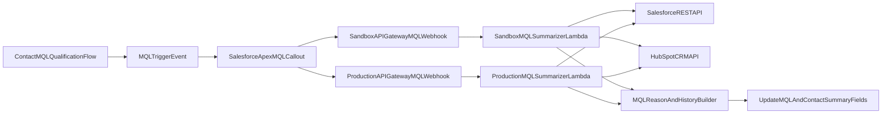

# MQL Lambda Implementation Plan

Last updated: 2026-02-10

This file is the canonical implementation plan for the MQL summary integration and is intended to be used as the build checklist during execution.

## Environment Strategy (Locked)

- Use two separate Lambda functions: one for Sandbox and one for Production.
- Keep shared summarization/business logic in a common module to avoid duplication.
- Use separate API Gateway routes/stages, IAM roles, secrets, and CloudWatch log groups per environment.
- Prevent cross-environment writes by design (sandbox Lambda credentials can only access sandbox systems; production Lambda credentials can only access production systems).

## Current Inventory (Validated)

- MQL qualification and lifecycle automation are already implemented in flows, including `Set_to_MQL__c` logic in [`force-app/main/default/flows/Contact_RT_AS_Set_to_MQL.flow-meta.xml`](../force-app/main/default/flows/Contact_RT_AS_Set_to_MQL.flow-meta.xml).
- MQL creation flow already maps `Engagement_AI_Summary__c` from Contact into MQL in [`force-app/main/default/flows/Contact_Us_SF_Convert_to_MQL.flow-meta.xml`](../force-app/main/default/flows/Contact_Us_SF_Convert_to_MQL.flow-meta.xml).
- Existing Apex webhook path is ticket-scoped only (`Ticket__c` triggers + callout) in [`force-app/main/default/classes/TicketSummarizerCallout.cls`](../force-app/main/default/classes/TicketSummarizerCallout.cls) and [`force-app/main/default/triggers/TicketSummarizerTrigger.trigger`](../force-app/main/default/triggers/TicketSummarizerTrigger.trigger).
- Sandbox already has API Gateway remote site entries for both environments.

## Target Architecture

## Validation Against Docs + MCP Communications

- [x] MQL trigger baseline exists in Salesforce automation.
- [x] MQL summary destination in Salesforce is expected (ticket `a0wJw00000DIDs9IAH`, email `11486`).
- [x] HubSpot source-event ingestion is largely implemented (`a0wJw00000DIDs9IAH`, `a0wJw00000EutS3IAJ`).
- [x] Contact Us scope changed from filtered to all topics (`a0wJw00000EutS3IAJ`).
- [x] Open-opportunity detection guidance is explicit (`Opportunity.IsClosed = false` or OCR formula `Open_Opportunity__c = true` in message `59362`).
- [x] Dual environment endpoint pattern exists today (existing callout + remote site setup pattern).
- [ ] MQL-specific webhook payload contract is not finalized.
- [ ] Integration auth model for MQL flow is not finalized.
- [ ] Integration-user permission boundary for Lambda writes is not documented.
- [ ] AI summary output standard remains open (also listed in [`documentation/MQL_COHERENT_SPEC.md`](./MQL_COHERENT_SPEC.md)).
- [ ] Campaign attribution remains active but separate scope (`a0wRo000005pZs5IAE`).
- [ ] HubSpot-to-Salesforce sync latency/capacity risks must be tested in rollout.

## Concrete Checklist (Execution-Ready)

### A) Contract and Scope Lock

- [ ] Approve MQL webhook event types (`mql_created`, `set_to_mql_triggered`, `mql_requalified`, `mql_converted`).
- [ ] Approve canonical payload v1 fields: `eventId`, `eventType`, `occurredAt`, `environment`, `contactId`, `mqlId`, `triggerSource`, `correlationId`.
- [ ] Approve idempotency key strategy (`eventId` + environment).
- [ ] Approve write-back targets: required `MQL__c.Engagement_AI_Summary__c`; optional Contact mirror field.
- [ ] Approve summary format contract (max length, timeline depth, allowed HTML/text, redaction rules).
- [ ] Record explicit non-goals for this phase (campaign attribution remains separate).

### B) Salesforce Build Checklist

- [ ] Add MQL callout Apex class mirroring the existing environment resolution pattern.
- [ ] Add MQL trigger/invocable entrypoint (after insert/update) with loop prevention and change guards.
- [ ] Ensure open-opportunity detection uses OCR formula or `Opportunity.IsClosed` logic (no hard-coded stage names).
- [ ] Add retry-safe failure logging strategy.
- [ ] Replace hardcoded secret patterns with Named Credential/External Credential for outbound webhook auth.
- [ ] Add/verify Remote Site Settings or Named Credential endpoints for both sandbox and production URLs.
- [ ] Add unit tests for payload shape, environment routing, and error handling.
- [ ] Add unit tests proving no recursive trigger behavior after summary field update.

### C) AWS/API (Dual Lambda) Checklist

- [ ] Create shared summarization package (Salesforce client, HubSpot client, summary builder, validators).
- [ ] Deploy `mql-summarizer-sandbox` Lambda with sandbox-only credentials and IAM policy.
- [ ] Deploy `mql-summarizer-production` Lambda with production-only credentials and IAM policy.
- [ ] Configure two API Gateway integrations/routes/stages mapped one-to-one to environment Lambdas.
- [ ] Add request authentication/authorization and reject unsigned/invalid requests.
- [ ] Enforce payload environment guardrail (sandbox event cannot call production clients, and vice versa).
- [ ] Implement idempotency store (DynamoDB or equivalent) with TTL and duplicate suppression.
- [ ] Implement dead-letter queue, retry policy, and alarm thresholds for failed invocations.
- [ ] Return deterministic status body while keeping Salesforce dependency on HTTP status.

Terraform implementation (AWS infra):

- Infrastructure is managed with Terraform in:
  - `infra/terraform/bootstrap/` (S3 remote state bucket + DynamoDB lock table)
  - `infra/terraform/mql/` (main stack: API Gateway, Lambdas, IAM, Secrets, DynamoDB idempotency, SQS DLQs, logs, alarms)
- Region is `us-west-1` for the MQL stack (per current decision).
- API Gateway auth for the Salesforce webhook uses API keys; Salesforce must send `x-api-key` (API Gateway does not accept API keys via `Authorization: Bearer`).
- Runbook: `infra/terraform/README.md`

### D) Data Enrichment and Summary Logic Checklist

- [ ] Fetch Salesforce contact/account/MQL/open-opportunity/lifecycle context via REST API.
- [ ] Fetch HubSpot behavior + fit + recent engagement context needed for explanation narrative.
- [ ] Normalize reason codes (qualification, behavior threshold, contact-us/manual path, open opp state).
- [ ] Build concise narrative + short action history with timestamps and source tags.
- [ ] Apply PII redaction/content safety filters before write-back.
- [ ] Upsert summary to MQL and optional Contact mirror with audit metadata (`lastSummaryAt`, `summaryVersion`).

#### D.1) API Connections and Data Inventory (Implementation Detail)

This section is the concrete, implementation-ready inventory of what the Lambda must fetch from Salesforce + HubSpot to construct a comprehensive MQL history narrative.

##### Salesforce (Lambda Read/Write)

Source-of-truth stance (discovery conclusion):

- Salesforce is the system-of-record for CRM and sales motion. The narrative timeline should be built primarily from Salesforce objects (MQL, Opportunity, Activities, Campaign membership, Contact Us submissions, history tables).
- HubSpot is the system-of-record for marketing scoring and web/email engagement signals. HubSpot is used to explain “marketing context” and score/conversion history, not to replace Salesforce CRM activity history.

Auth (recommended default):

- Use OAuth 2.0 JWT Bearer Flow with a Salesforce Connected App + X.509 cert, using a dedicated integration user per environment.
- Keep the integration user least-privileged: read Contact/Account/Opp/OCR/Task/Event as needed; write only `MQL__c.Engagement_AI_Summary__c` and (if approved) the Contact mirror summary field.

Minimum Salesforce objects to fetch (v1 narrative):

- `Contact` (trigger context + qualification and scoring fields).
- `Account` (qualification and company fit / ownership context).
- `MQL__c` (the MQL record we will write back to, plus mapping fields used to explain “why”).
- `OpportunityContactRole` (open-opportunity determination; the flows reference `Open_Opportunity__c` on OCR).
- `Opportunity` (stage/closed state and timing).
- `Task` and `Event` (sales activity context; bounded by recency caps).
- `EmailMessage` (email timeline metadata; omit bodies by default).
- `CampaignMember` (campaign touch history in Salesforce; bounded by recency caps).
- `Contact_Us__c` (Contact Us submissions captured in Salesforce; bounded and PII-aware).
- History tables (if enabled and accessible):
  - `ContactHistory`
  - `OpportunityFieldHistory`
  - `MQL__History` (note: `MQL__c` has history enabled in metadata)

Salesforce allowlist (derived from sandbox discovery bundles):
Canonical machine-readable version:

- `documentation/mql_allowlist_v1.json`

Objects (required):

- `Contact`
- `Account` (via `Contact.AccountId`)
- `MQL__c` (latest for contact, plus the specific MQL referenced by webhook when available)
- `OpportunityContactRole` (open-opportunity check)
- `Opportunity` (for OCR-linked opportunities)

Objects (optional, only if present/accessible in org):

- `Task` (sales activity timeline)
- `Event` (sales activity timeline)
- `EmailMessage` (email timeline metadata; exclude bodies by default)
- `CampaignMember` (campaign touch history)
- `Contact_Us__c` (Contact Us submissions stored in Salesforce)
- History tables: `ContactHistory`, `OpportunityFieldHistory`, `MQL__History`

Field allowlist (required unless noted as optional):

- `Contact`:
  - Identity: `Id`, `Name`, `FirstName`, `LastName`, `Email`, `Phone`, `OwnerId`, `AccountId`, `RecordTypeId`, `CreatedDate`, `LastModifiedDate`
  - MQL gating/lifecycle: `Set_to_MQL__c`, `MQL_Lifecycle_Stage__c`, `Last_Date_MQL__c`, `Last_Date_Recycled__c`, `Contact_Status__c`, `Private_Sector_Non_Qual__c`, `Private_Sector_Acct_Non_Qual__c`
  - HubSpot-synced marketing context (used for narrative context; prefer HubSpot as source-of-truth when available): `HubSpot_Engagement_Score__c`, `HubSpot_Engagement_Score_Threshold__c`, `HubSpot_First_Conversion__c`, `HubSpot_First_Conversion_Date__c`, `HubSpot_Recent_Conversion__c`, `HubSpot_Recent_Conversion_Date__c`, `HubSpot_Last_Engagement_Date__c`, `HubSpot_Sends_Since_Last_Engagement__c`, `HubSpot_Last_Marketing_Email_Name__c`, `HubSpot_Last_Marketing_Email_Open_Date__c`, `HubSpot_Last_Marketing_Email_Send_Date__c`
  - HubSpot-synced scoring inputs referenced by the Salesforce MQL trigger flow: `HubSpot_Private_Sector_Behavior_Score__c`, `HubSpot_Private_Sector_Behavior_Date__c`, `HubSpot_Private_Sector_Contact_Fit__c`, `Contact_Fit_Threshold__c`
  - AI summary mirror (optional): `Engagement_AI_Summary__c`
  - HubSpot id fields (optional optimization only; do not require): `Hubspot__c` and any discovered hs/vid/object id fields if present
- `Account`:
  - `Id`, `Name`, `OwnerId`, `RecordTypeId`, `CreatedDate`, `LastModifiedDate`
  - Qualification/fit: `Private_Sector_Non_Qual__c`, `Company_Fit_Threshold__c`, `Placeholder_Account__c`
- `MQL__c`:
  - Identity: `Id`, `Name`, `OwnerId`, `CreatedDate`, `LastModifiedDate`, `Contact__c`
  - State/timing: `MQL_Date__c`, `MQL_Status__c`, `Conversion_Date__c`, `Conversion_Type__c`, `Converted_By__c`
  - Linkage: `Opportunity__c`, `Campaign__c`, `Contact_Us__c`
  - Explanation context: `Lead_Source__c`, `Lead_Source_Detail__c`, `Lead_Detail_1__c`, `Lead_Detail_2__c`, `Lead_Detail_3__c`, `Lead_Detail_4__c`, `Lead_Notes__c`, `Product__c`, `Product_Name__c`
  - Write-back target: `Engagement_AI_Summary__c`
- `OpportunityContactRole`:
  - `Id`, `ContactId`, `OpportunityId`, `CreatedDate`, `Open_Opportunity__c`
- `Opportunity`:
  - `Id`, `Name`, `AccountId`, `OwnerId`, `StageName`, `IsClosed`, `IsWon`, `CloseDate`, `Amount`, `CreatedDate`, `LastModifiedDate`

Salesforce timeline objects (optional allowlists):

- `Task`: `Id`, `Subject`, `Status`, `Priority`, `Type`, `ActivityDate`, `CreatedDate`, `LastModifiedDate`, `WhoId`, `WhatId`, `OwnerId`
- `Event`: `Id`, `Subject`, `ActivityDate`, `StartDateTime`, `EndDateTime`, `Location`, `CreatedDate`, `LastModifiedDate`, `WhoId`, `WhatId`, `OwnerId`
- `EmailMessage` (metadata only): `Id`, `Subject`, `FromAddress`, `ToAddress`, `MessageDate`, `Incoming`, `Status`, `CreatedDate`, `LastModifiedDate`, `ParentId`, `RelatedToId`
- `CampaignMember`: `Id`, `CampaignId`, `Campaign.Name`, `Status`, `HasResponded`, `FirstRespondedDate`, `CreatedDate`
- `Contact_Us__c`: `Id`, `Topic__c`, `Source__c`, `CreatedDate` (avoid pulling free-text message fields into discovery/prompt by default)

Known Salesforce fields referenced by automation (must be included if they exist in the org):

- From `Contact` trigger flow [`force-app/main/default/flows/Contact_RT_AS_Set_to_MQL.flow-meta.xml`](../force-app/main/default/flows/Contact_RT_AS_Set_to_MQL.flow-meta.xml):
  - `HubSpot_Private_Sector_Behavior_Score__c`, `HubSpot_Private_Sector_Behavior_Date__c`
  - `HubSpot_Private_Sector_Contact_Fit__c`
  - `Contact_Fit_Threshold__c`
  - `MQL_Lifecycle_Stage__c`, `Last_Date_MQL__c`, `Last_Date_Recycled__c`
  - `Set_to_MQL__c`
  - `Private_Sector_Non_Qual__c`, `Private_Sector_Acct_Non_Qual__c`
- From Contact Us -> MQL conversion flow [`force-app/main/default/flows/Contact_Us_SF_Convert_to_MQL.flow-meta.xml`](../force-app/main/default/flows/Contact_Us_SF_Convert_to_MQL.flow-meta.xml):
  - Contact-side `Engagement_AI_Summary__c` is used as the source mapping into `MQL__c.Engagement_AI_Summary__c` (field presence must be verified via describe).
- From Open Opportunity check guidance:
  - OCR `Open_Opportunity__c` (formula/flag indicating the OCR is tied to an open opportunity)

Concrete SOQL projections (examples; discovery scripts dynamically include only existing fields):

- Contact (core + MQL gate + score inputs):
  - `SELECT Id, Name, Email, Phone, AccountId, OwnerId, RecordTypeId, CreatedDate, LastModifiedDate, Set_to_MQL__c, MQL_Lifecycle_Stage__c, Last_Date_MQL__c, Last_Date_Recycled__c, Private_Sector_Non_Qual__c, Private_Sector_Acct_Non_Qual__c, HubSpot_Private_Sector_Behavior_Score__c, HubSpot_Private_Sector_Behavior_Date__c, HubSpot_Private_Sector_Contact_Fit__c, Contact_Fit_Threshold__c, Engagement_AI_Summary__c FROM Contact WHERE Id = :contactId`
- Latest MQL for a Contact:
  - `SELECT Id, Name, OwnerId, CreatedDate, LastModifiedDate, MQL_Date__c, MQL_Status__c, Contact__c, Lead_Source__c, Lead_Source_Detail__c, Lead_Detail_1__c, Lead_Detail_2__c, Lead_Detail_3__c, Lead_Detail_4__c, Lead_Notes__c, Product__c, Campaign__c, Opportunity__c, Conversion_Date__c, Conversion_Type__c, Converted_By__c, Contact_Us__c, Engagement_AI_Summary__c FROM MQL__c WHERE Contact__c = :contactId ORDER BY CreatedDate DESC LIMIT 1`
- Open Opportunity via OCR (as the flow does):
  - `SELECT Id, ContactId, OpportunityId, Open_Opportunity__c, CreatedDate FROM OpportunityContactRole WHERE ContactId = :contactId AND Open_Opportunity__c = true`
- Opportunities for those OCRs:
  - `SELECT Id, Name, StageName, IsClosed, IsWon, CloseDate, Amount, OwnerId, AccountId, CreatedDate, LastModifiedDate FROM Opportunity WHERE Id IN :oppIds`
- MQL history (custom object history table):
  - `SELECT Field, OldValue, NewValue, CreatedDate, CreatedById FROM MQL__History WHERE ParentId = :mqlId ORDER BY CreatedDate DESC`

Discovery tooling (checked into repo):

- `node scripts/discovery/sf_mql_context.js --contact-id <003...> --target-org mql-sandbox`
- Outputs to `.local/discovery/sf/` (ignored by Git).

##### HubSpot (Lambda Read)

Auth:

- Use HubSpot Private App token stored in AWS Secrets Manager/SSM, injected into Lambda as an env var.
- Scopes required for marketing-context enrichment (recommended baseline):
  - `crm.objects.contacts.read`
  - Optional: `crm.objects.owners.read` (resolve owner ids to names)
- Optional scopes if we also want to pull HubSpot CRM objects (often Salesforce-synced):
  - `crm.objects.companies.read`
  - `crm.objects.deals.read`
  - Optional (1:1 email content): `sales-email-read`

HubSpot usage assumption (updated):

- Do not depend on HubSpot notes/calls/meetings/tasks/emails being present. Treat HubSpot CRM activities as optional and likely empty if Sales teams operate fully in Salesforce.
- Prefer Salesforce activity objects for the narrative timeline. Use HubSpot primarily for marketing score/lifecycle/conversion context and property history.

Salesforce -> HubSpot identity resolution (must be deterministic):

1. Prefer a stored HubSpot contact id on Salesforce `Contact` if present (discover in sandbox by `Contact` describe; candidate names often contain `hubspot`, `hs_`, `vid`, `objectid`).
2. Fallback: search HubSpot by email (already used in Salesforce code for Contact Us handling in [`force-app/main/default/classes/ContactUsRequestController.cls`](../force-app/main/default/classes/ContactUsRequestController.cls)).
3. If email is missing or ambiguous, stop and write an explicit “insufficient identity resolution” note into logs; do not guess.

HubSpot API endpoints to use (v1 narrative):

- Resolve contact by email:
  - `POST /crm/v3/objects/contacts/search` (filter `email EQ <email>`)
- Contact snapshot + property history (key scoring/lifecycle props):
  - `GET /crm/v3/objects/contacts/{contactId}?properties=...&propertiesWithHistory=...`
- Associations:
  - `GET /crm/v3/objects/contacts/{contactId}/associations/companies`
  - `GET /crm/v3/objects/contacts/{contactId}/associations/deals`
  - `GET /crm/v3/objects/contacts/{contactId}/associations/{notes|calls|meetings|tasks|emails}`
- Company snapshot + property history (firmographics/company-fit context if stored at company level):
  - `GET /crm/v3/objects/companies/{companyId}?properties=...&propertiesWithHistory=...`
- Deal snapshot + dealstage history (timeline of sales progression):
  - `GET /crm/v3/objects/deals/{dealId}?properties=...&propertiesWithHistory=dealstage`
- Activities batch read (recency bounded; bodies may contain PII):
  - `POST /crm/v3/objects/{notes|calls|meetings|tasks|emails}/batch/read`

HubSpot properties to include:

- Start with an explicit allowlist in production (kept in code), and augment by org-specific discovery in sandbox.
- At minimum, include properties written by this project (Contact Us integration):
  - `contact_request_topic`, `salesforce_contact_message`, plus `lifecyclestage` and `hs_lead_status`.
- Include scoring/lifecycle properties aligned to the MQL trigger flow (names are org-specific; discover via properties list + regex filter).

Discovery findings (sandbox token + sample contacts):

- Salesforce does not reliably store a HubSpot contact id (field `Hubspot__c` exists but was null in sampled records). Default identity resolution should be HubSpot contact search by `Contact.Email`.
- The current HubSpot token used for discovery lacks permissions for:
  - companies (requires `companies-read` / `crm.objects.companies.read`)
  - deals (requires `deals-read` / `crm.objects.deals.read`)
    Without these scopes, the narrative cannot include company-fit history from HubSpot companies or deal stage history from HubSpot deals.
- The current token also returned zero associations for activities (notes/calls/meetings/tasks/emails) for sampled contacts; treat “HubSpot CRM activity history” as gated behind both scope enablement and actual portal usage patterns until proven otherwise.
- After enabling `crm.objects.companies.read` and `crm.objects.deals.read`, HubSpot association lookups succeeded for sampled contacts (companies and deals were returned when present). Deal stage history (`dealstage` with history) is available and includes `sourceType: SALESFORCE` in the sampled portal, implying deal stage may be Salesforce-driven in this environment.

Initial Salesforce ⇄ HubSpot mapping matrix (v1; extend after additional discovery):

- Identity
  - Salesforce: `Contact.Email`
  - HubSpot: `contacts.email` (search key)
- Lifecycle / lead status
  - Salesforce: `Hubspot_Lifecycle_Stage__c` (if present) and/or `Contact.MQL_Lifecycle_Stage__c` (Salesforce-side stage)
  - HubSpot: `lifecyclestage`, `hs_lead_status`
- Engagement score (HubSpot-derived)
  - Salesforce: `HubSpot_Engagement_Score__c`, `HubSpot_Engagement_Score_Threshold__c`
  - HubSpot: `engagement_score`, `engagement_score_threshold`
  - Note: sampled records show numeric divergence between Salesforce and HubSpot for “engagement_score”; treat Salesforce values as a cached/derived indicator and prefer HubSpot properties for the narrative when available.
- Conversion (first/recent)
  - Salesforce: `HubSpot_First_Conversion__c`, `HubSpot_First_Conversion_Date__c`, `HubSpot_Recent_Conversion__c`, `HubSpot_Recent_Conversion_Date__c`
  - HubSpot: `first_conversion_event_name`, `first_conversion_date`, `recent_conversion_event_name`, `recent_conversion_date`
  - Note: sampled records show that Salesforce `HubSpot_Recent_Conversion__c` can be stale relative to HubSpot `recent_conversion_event_name`; prefer HubSpot values for recency-sensitive timeline entries.
- “Private sector” behavior/fit scoring inputs used by the Salesforce MQL trigger flow
  - Salesforce: `HubSpot_Private_Sector_Behavior_Score__c`, `HubSpot_Private_Sector_Behavior_Date__c`, `HubSpot_Private_Sector_Contact_Fit__c`
  - HubSpot (observed candidate properties in portal): `industry_behavior_score`, `industry_behavior_score_threshold`, `industry_fit`, `industry_fit_threshold`, `last_webinar_attended_date__behavior_lead_score_`
  - Note: property naming does not include `private_sector_*` in the portal properties list; confirm the true source-of-truth property names by comparing values for the same contact in both systems.
  - Note: sampled records show `industry_fit` aligns with Salesforce `HubSpot_Private_Sector_Contact_Fit__c` for multiple contacts; behavior score alignment needs calibration (non-zero values did not match cleanly in at least one sample).

Discovery tooling (checked into repo):

- `node scripts/discovery/hubspot_mql_context.js --email someone@domain.com`
- `node scripts/discovery/hubspot_mql_context.js --hs-contact-id <id>`
- Outputs to `.local/discovery/hubspot/` (ignored by Git).

Discovery runbook (local, safe-by-default):

1. Ensure Salesforce CLI access (Sandbox):
   - `npm run sf:auth:sandbox`
2. Run Salesforce bundle export for a known Contact/MQL:
   - `node scripts/discovery/sf_mql_context.js --contact-id <003...> --target-org mql-sandbox`
3. Add HubSpot token locally (never commit):
   - `cp .env.example .env` and fill `HUBSPOT_PRIVATE_APP_TOKEN=...` (or export it in your shell)
4. Run HubSpot bundle export using either email or HubSpot contact id:
   - `node scripts/discovery/hubspot_mql_context.js --email someone@domain.com --since-days 365 --max-per-type 50`
5. Use the resulting JSON outputs as the source for final property/field allowlists in Lambda code (and attach them to the implementation ticket if needed).

#### D.2) Normalized Timeline Model (for LLM Context Window)

The Lambda should normalize Salesforce + HubSpot data into a single event stream before constructing the narrative. This is both a quality and context-window control mechanism.

`HistoryEvent` shape (JSON):

- `occurredAt`: ISO-8601 timestamp (required)
- `sourceSystem`: `salesforce` | `hubspot` (required)
- `sourceObjectType`: ex `Contact`, `MQL__c`, `Opportunity`, `Deal`, `Email`, `Note` (required)
- `sourceObjectId`: stable id in the source system (required)
- `eventType`: stable enum (required; examples below)
- `title`: short human-readable label (required)
- `detail`: brief detail string (optional; redacted/truncated)
- `importance`: `high` | `medium` | `low` (required)
- `correlationId`: propagated from webhook payload when available (optional)

Suggested `eventType` values (v1):

- `mqlCreated`, `mqlConverted`, `mqlRejected`, `mqlRecycled`, `mqlRequalified`
- `scoreChanged`, `lifecycleStageChanged`, `leadStatusChanged`
- `contactUsSubmitted`
- `openOpportunityDetected`, `opportunityStageChanged`, `dealStageChanged`
- `meetingLogged`, `callLogged`, `noteAdded`, `emailEngagement`, `taskCompleted`

#### D.3) Salesforce-Centric Timeline Recipe (Objects -> HistoryEvent)

Build the timeline primarily from Salesforce. HubSpot contributes only marketing scoring/conversion context (Section D.1), not CRM activities.

Always-include Salesforce events (even if older than the recency window):

- `MQL__c`:
  - `mqlCreated`: from `MQL__c.CreatedDate` and `MQL__c.MQL_Date__c` (if set)
  - `mqlConverted`: when `MQL__c.MQL_Status__c = Converted` (use `Conversion_Date__c` if populated; otherwise fallback to `CreatedDate`)
  - `mqlRejected`: when `MQL__c.MQL_Status__c = Rejected` (use latest `MQL__History` entry for `MQL_Status__c` if available)
  - `mqlRequalified`/`mqlRecycled`: use `MQL__History` (preferred) and/or Contact lifecycle fields if your org encodes these states there
- `OpportunityContactRole` + `Opportunity`:
  - `openOpportunityDetected`: for any OCR where `Open_Opportunity__c = true`
  - `opportunityStageChanged`: from `OpportunityFieldHistory` (Field = StageName) if available; else treat latest `Opportunity.StageName` as current state and emit a single “current stage” event

Recency-bounded Salesforce events (default window 365d; cap per type):

- `Task`:
  - `taskCompleted` or `taskLogged`:
    - Completed tasks: `Status = Completed`
    - Otherwise: generic “task logged”
- `Event`:
  - `meetingLogged`: from `Event.Subject` and `StartDateTime`/`ActivityDate`
- `EmailMessage` (metadata-only):
  - `emailEngagement`: subject/from/to + `MessageDate`; do not include body content in prompt
- `CampaignMember`:
  - `campaignTouch`: campaign name + status + responded flag + first responded date (if present)
- `Contact_Us__c`:
  - `contactUsSubmitted`: topic + source + created date (avoid message bodies in the prompt by default)

Suggested `importance` assignment:

- `high`: MQL creation/conversion/rejection, open opportunity detected, opportunity stage changes, Contact Us submissions
- `medium`: completed tasks, scheduled events/meetings, campaign member responded events
- `low`: non-completed tasks, non-response campaign touches, email metadata-only touches

Deduplication:

- Compute a deterministic signature from `{sourceSystem, eventType, sourceObjectId}` and a coarse time bucket (ex minute-level). Drop duplicates produced by overlapping APIs or retries.

Recency-biased selection (default policy for “full CRM activity”, bounded for LLM):

- Always include (even if old):
  - MQL creation + conversion/recycle state transitions (Salesforce MQL fields + `MQL__History` if available)
  - The latest 3 scoring/lifecycle transitions (HubSpot property history and/or Salesforce mirrored score fields)
  - Most recent open-opportunity or dealstage transition (Salesforce OCR/Opp and HubSpot dealstage history)
- Then fill up to `N = 25` additional events using weighted recency:
  - Prefer last 30 days, then 60, then 90, then 365 (stop when full)
  - Cap per category to avoid a single channel dominating:
    - max 5 emails, max 5 meetings/calls, max 5 notes, max 5 tasks, max 5 form submissions/score transitions
- Truncate bodies aggressively:
  - Keep subjects/titles, timestamps, and who/owner attribution; avoid full email/note bodies unless explicitly needed for “why”.

PII handling:

- Treat HubSpot activity bodies and free-text fields as high-risk. Redact emails, phone numbers, and addresses at minimum before the prompt is built.

### E) Validation and QA Checklist

- [ ] Execute sandbox scenario set for all decision matrix branches in the coherent spec.
- [ ] Validate Contact Us pathway now that all topics can feed behavior scoring.
- [ ] Validate duplicate webhook delivery handling and idempotency behavior.
- [ ] Validate failure modes: HubSpot timeout, Salesforce API timeout, partial update retries.
- [ ] Measure end-to-end latency from `Set_to_MQL__c` transition to summary availability.
- [ ] Validate summary quality against sample sandbox records and list views.

### F) Release and Operations Checklist

- [ ] Complete sandbox sign-off with Salesforce Ops, Marketing Ops, and Development.
- [ ] Promote Salesforce metadata and shared Lambda artifact to production with env-specific config only.
- [ ] Execute production smoke tests with controlled records and explicit rollback plan.
- [ ] Enable dashboards/alerts per environment (errors, latency, retry count, duplicate drops).
- [ ] Run first-week hypercare with daily triage and adjustment log.
- [ ] Document change-control process for scoring updates and summary prompt/version changes.

## Delivery Phases

### 1) Discovery and Contract Finalization

- Define canonical webhook payload for reuse pattern (minimum: `contactId`, optional `mqlId`, `eventType`, `triggerSource`, `environment`, `occurredAt`).
- Confirm source event(s):
  - threshold-trigger path (`Set_to_MQL__c` transitions)
  - manual/flow conversion path(s) that create MQL records
- Decide where summary writes back first-class:
  - primary: `MQL__c.Engagement_AI_Summary__c`
  - optional mirror: Contact summary field for cross-record visibility
- Produce an explicit reason code list (fit qualified, behavior threshold crossed, contact-us/manual conversion, open opportunity condition) aligned to [`documentation/MQL_COHERENT_SPEC.md`](./MQL_COHERENT_SPEC.md).

### 2) Salesforce Build (Reuse Existing Callout Pattern)

- Add MQL-specific Apex callout class (parallel to ticket callout) with:
  - environment resolution
  - request payload serializer
  - resilient error handling and idempotency guard
- Add trigger or invocable entrypoint for MQL events:
  - preferred: `MQL__c` after insert/update trigger keyed to creation/qualification states
  - secondary: flow action callout from existing MQL flows where data context is already resolved
- Add/adjust unit tests for payload correctness, callout outcomes, and loop prevention.
- Replace hardcoded secrets pattern with Named Credential/External Credential strategy where possible.

### 3) AWS/API Build

- API Gateway:
  - add/extend environment-specific routes for MQL summarization using separate Sandbox and Production endpoints
  - enforce authentication (API key or signed token)
- Lambda deployment model:
  - deploy two functions (`mql-summarizer-sandbox`, `mql-summarizer-production`) from one shared codebase
  - isolate environment config: Salesforce base URL, OAuth credentials, HubSpot credentials, write-back guardrails
  - enforce environment scoping in code
- Lambda runtime logic (shared):
  - validate payload + dedupe key
  - fetch Salesforce context (Contact, Account, latest MQL, OCR/open-opportunity status, lifecycle fields)
  - fetch HubSpot context (fit/behavior history + recent engagement)
  - assemble concise summary and short timeline
  - PATCH summary back to Salesforce fields
- Add observability: structured logs, correlation IDs, failure metrics, DLQ/retry handling.

### 4) Data Quality, Security, and Compliance

- Enforce secret management in AWS Secrets Manager/SSM.
- Confirm least-privilege Salesforce integration user scopes.
- Add PII redaction rules in summary/timeline output.
- Define retention strategy for generated summaries and Lambda logs.

### 5) Test Matrix and Rollout

- Sandbox E2E scenarios:
  - qualified + no open opp (MQL + Opp path)
  - qualified + active opp (MQL-only path)
  - unqualified path (Opp-only; ensure no false summary update)
  - Contact Us conversion path
  - retry/idempotency on duplicate webhook deliveries
- Validate performance/SLA: end-to-end summary availability after MQL trigger.
- Production rollout:
  - validate org auth + metadata parity
  - deploy Salesforce metadata and Sandbox Lambda/API first; complete sandbox sign-off
  - promote shared artifact to Production Lambda/API with production-only secrets and IAM
  - smoke test with controlled records in both environments
  - monitor first-week error and latency dashboards separately for each Lambda

## Repo-Level Execution Map

- Documentation updates:
  - [`README.md`](../README.md)
  - [`documentation/MQL_COHERENT_SPEC.md`](./MQL_COHERENT_SPEC.md)
- Salesforce metadata likely to add/update:
  - `force-app/main/default/classes/*MQL*Summarizer*.cls`
  - `force-app/main/default/triggers/*MQL*.trigger`
  - `force-app/main/default/classes/*Test.cls`
  - `manifest/package.xml`
- AWS implementation location (new repo or infra folder) should include:
  - shared Lambda handler library
  - environment-specific Lambda entrypoints/config
  - Salesforce/HubSpot client modules
  - summary builder + prompt template
  - IaC for two API Gateway integrations, auth, secrets, logs, IAM, and alarms

## Immediate Next Actions

1. Run a 60-minute contract workshop to lock payload schema, write-back field targets, auth model, and summary format.
2. Execute Section A checklist to completion before implementation starts.
3. Build Salesforce MQL callout scaffolding + tests in sandbox, then execute Section B validation gates.
4. Implement shared Lambda logic and deploy separate Sandbox/Production handlers, then execute Sections C-E in order.
5. Complete Section F release gates and begin hypercare.
